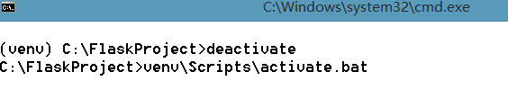
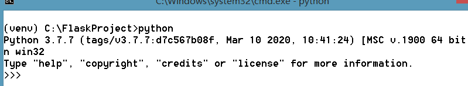

## python3.7创建虚拟环境

>  用于创建和管理虚拟环境的模块称为 [`venv`](https://docs.python.org/zh-cn/3.7/library/venv.html#module-venv)。[`venv`](https://docs.python.org/zh-cn/3.7/library/venv.html#module-venv) 通常会安装你可用的最新版本的 Python。如果您的系统上有多个版本的Python，您可以通过运行 `python3` (python)或您想要的任何版本来选择特定的Python版本。
>
> 要创建虚拟环境，请确定要放置它的目录，并将 [`venv`](https://docs.python.org/zh-cn/3.7/library/venv.html#module-venv) 模块作为脚本运行目录路径: 

```
python -m venv tutorial-venv
```

如果它不存在，这将创建 `tutorial-env` 目录，并在其中创建包含Python解释器，标准库和各种支持文件的副本的目录。

创建虚拟环境后，您可以激活它。

在**Windows**上，运行:

```
tutorial-env\venv\Scripts\activate.bat
```

在这里，自己创建了FlaskProject目录下的虚拟环境，如下图所示。





## 推送一个本地标签

```
git push origin <tagname>
```

## 推送全部未推送标签

```
git push origin --tags
```

## 删除一个本地标签

```
git tag -d <tagname>
```
## 删除一个远程标签

```
git push origin :refs/tags/<tagname>
```

## 丢弃工作区修改

```
git checkout -- file
```

## 撤销暂存区修改

```
git reset HEAD <file>
```

## 从版本库删除文件

```
git rm file
git commit -m "remove"
```

## 版本回退

- 
  HEAD指向的版本就是当前版本，因此，Git允许我们在版本的历史之间穿梭，使用命令`git reset --hard commit_id`


- 穿梭前，用`git log`可以查看提交历史，以便确定要回退到哪个版本

- 要重返未来，用`git reflog`查看命令历史，以便确定要回到未来的哪个版本

## 创建+切换分支

```
git checkout -b <name>或者git switch -c <name>
```

## 合并某分支到当前分支

```
git merge <name>
```

## 配置别名

```
git config --global alias.co checkout
git config --global alias.ci commit
git config --global alias.br branch
git config --global alias.unstage 'reset HEAD'
```

